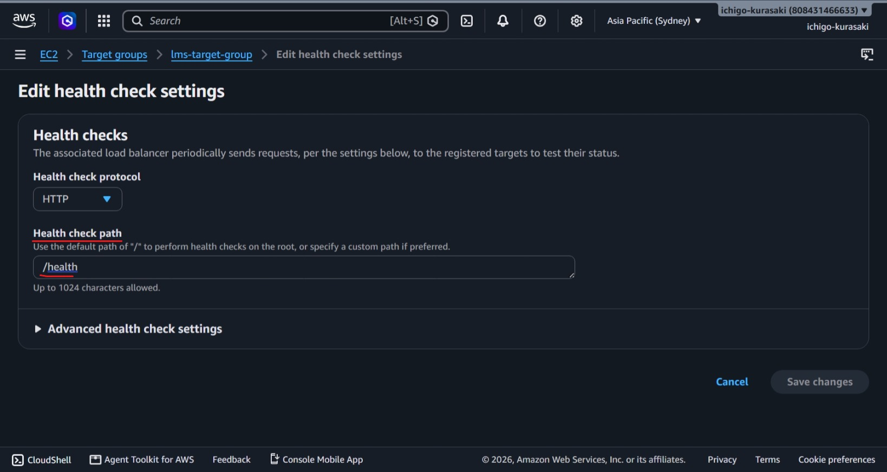
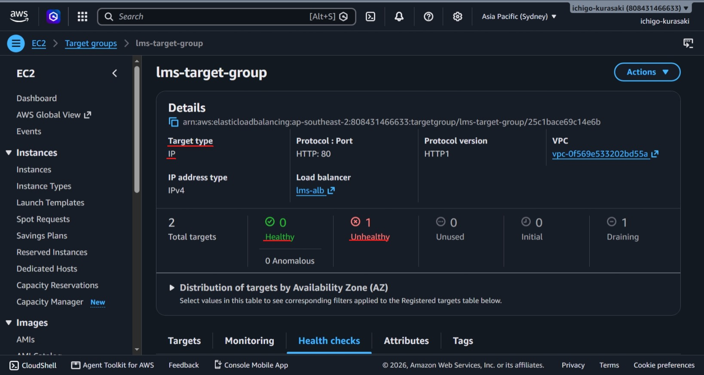

# Lab 01 – ALB Health Check Misconfiguration

## Objective

Simulate an Application Load Balancer (ALB) health check failure and restore service availability.

---

## Scenario

The ALB health check path was intentionally changed from the valid endpoint (`/`) to an invalid endpoint (`/health`).

---

## Impact

- Target marked **Unhealthy**
- ALB stopped routing traffic
- Application became unavailable
- ECS task remained running

---

## Root Cause

The configured health check endpoint did not exist, resulting in HTTP **404** responses.

---

## Resolution

- Restored the health check path to `/`
- Waited for the target to become **Healthy**
- Verified the application was reachable again

---

## Screenshots

### 1. Health Check Misconfigured

---

### 2. Target Marked Unhealthy

---

## Result

Successfully reproduced and resolved an ALB health check misconfiguration by correcting the target group's health check path.
