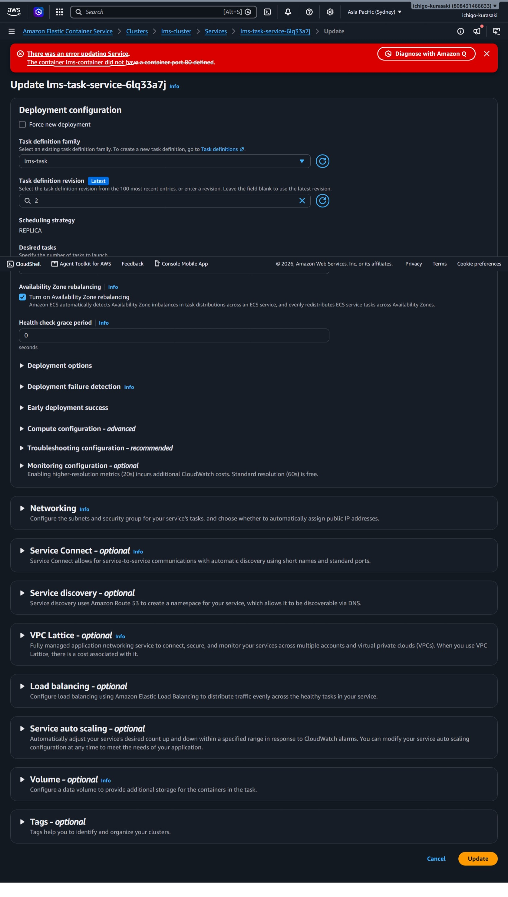
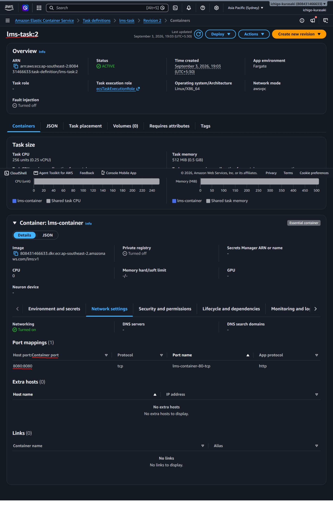

# Lab 02 – ECS Container Port Mapping Misconfiguration

## Objective

This lab demonstrates how an incorrect container port mapping in an Amazon ECS task definition can prevent a service from deploying successfully.

---

## Technologies Used

- Amazon ECS (Fargate)
- Amazon ECR
- Application Load Balancer
- Docker
- Nginx

---

## Scenario

The application was successfully deployed and running behind an Application Load Balancer.

To simulate a deployment issue, the container port mapping in the ECS task definition was intentionally modified from the expected port configuration.

When the ECS service was updated to use the new task definition, the deployment failed immediately.

---

## Problem Introduced

The container definition no longer exposed the expected container port:

Expected:

```
80
```

Misconfigured:

```
8080
```

The Application Load Balancer target group was still configured to forward traffic to container port **80**.

---

## Symptoms

During the ECS service update, AWS displayed the following error:

```
The container lms-container did not have a container port 80 defined.
```

The new task definition could not be deployed because the ECS service expected the container to expose port **80**.

---

## Investigation

The task definition was reviewed, and the container definition showed an incorrect port mapping.

The Application Load Balancer configuration expected traffic on port **80**, creating a mismatch between the ECS service and the task definition.

---

## Root Cause

The container port defined in the task definition did not match the port configured in the ECS service and Application Load Balancer.

Since ECS validates this configuration before deployment, the service update failed.

---

## Resolution

The issue was resolved by:

1. Creating a new task definition revision.
2. Updating the container port mapping back to **80**.
3. Registering the new task definition.
4. Updating the ECS service to use the corrected revision.
5. Verifying that the deployment completed successfully.

---

## Lessons Learned

- Container port mappings must match the ECS service configuration.
- The Application Load Balancer target group must forward traffic to the correct container port.
- ECS validates task definitions before starting a deployment, helping prevent invalid configurations.

---

# Screenshots

## 1. ECS Service Update Error




The ECS service failed to update because the expected container port was not defined.

---

## 2. Misconfigured Task Definition



The task definition exposed an incorrect container port, causing the deployment validation to fail.

---

## Result

The deployment issue was successfully reproduced and resolved by correcting the container port mapping in the ECS task definition and deploying a new revision.
