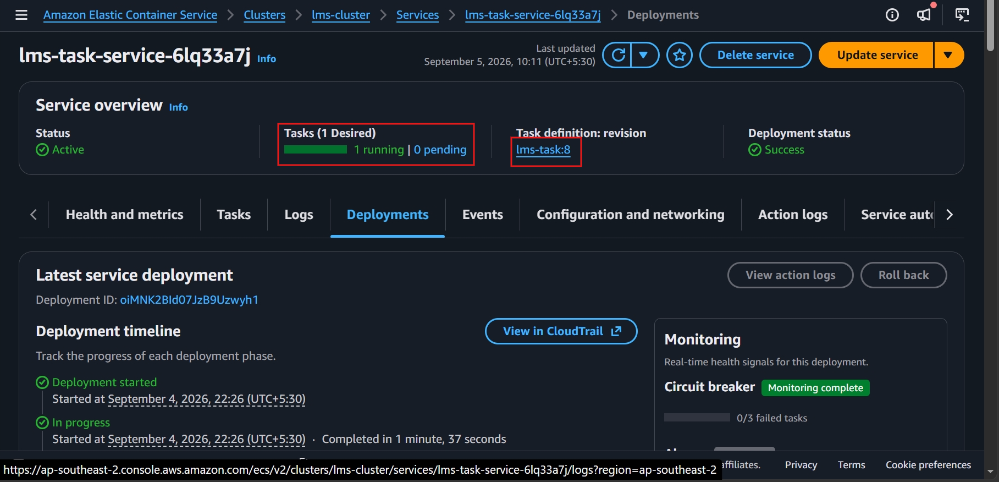
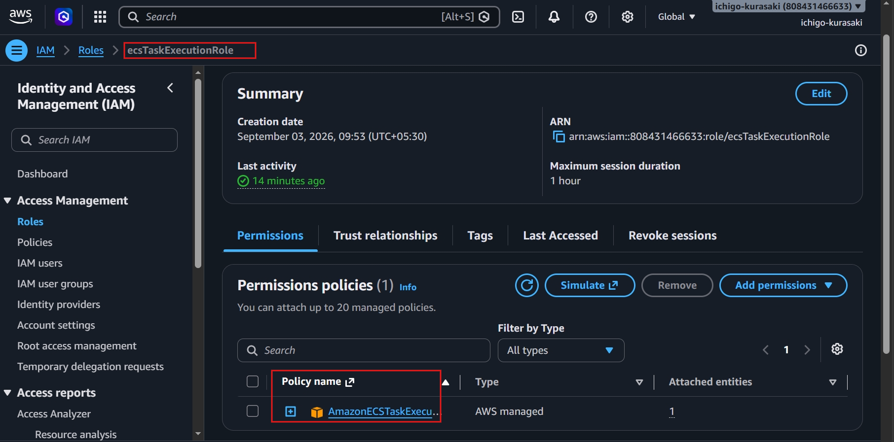
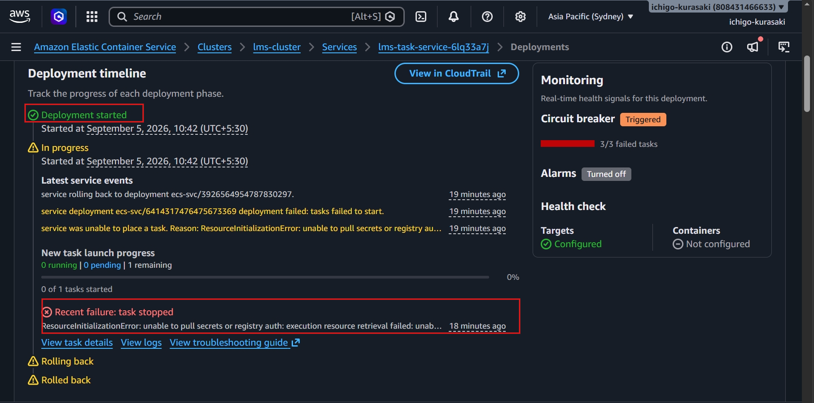
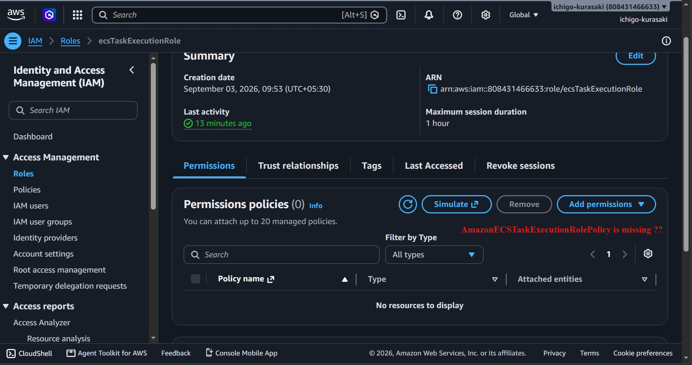
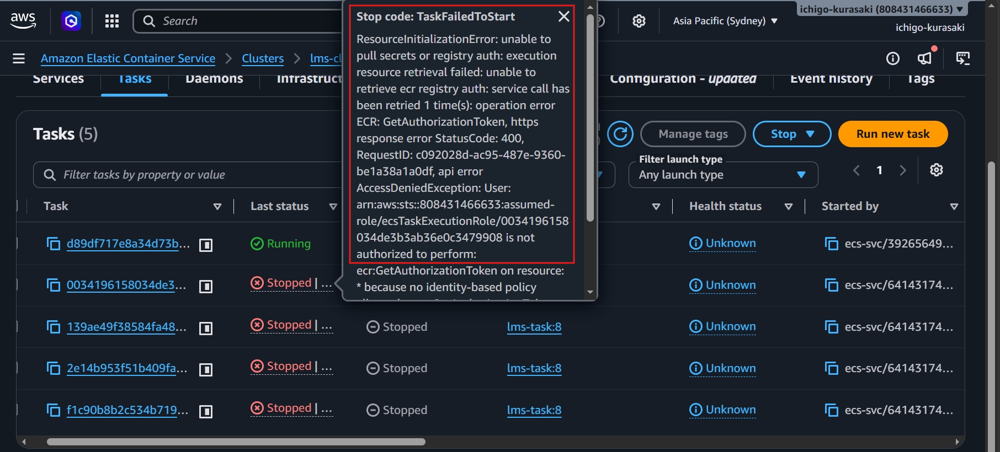
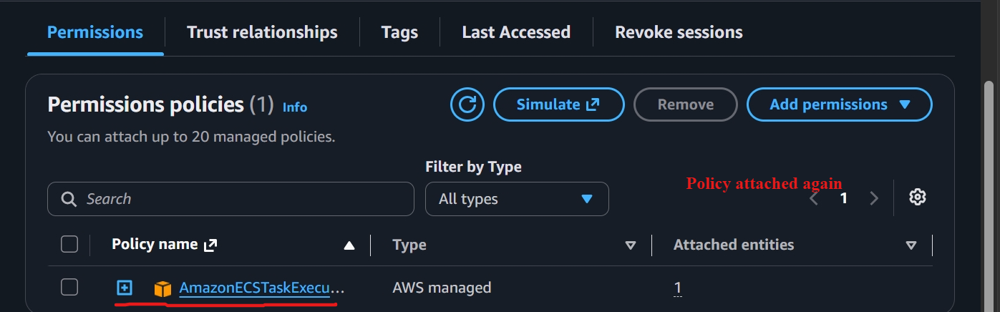
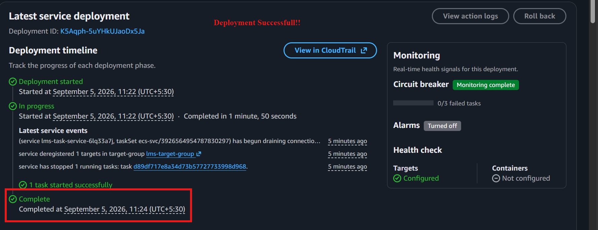
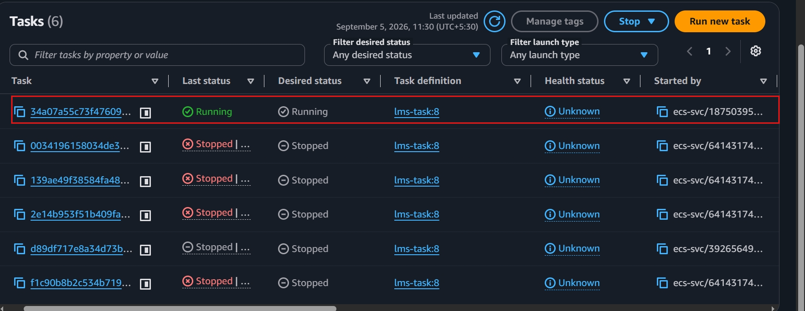

# Lab 05 – ECS IAM Execution Role Misconfiguration

## Objective

Simulate an Amazon ECS deployment failure caused by insufficient IAM permissions on the ECS Task Execution Role and restore the service.

---

## Scenario

The managed policy **AmazonECSTaskExecutionRolePolicy** was intentionally detached from the ECS Task Execution Role before deploying a new task revision.

---

## Impact

- ECS deployment failed
- New tasks could not start
- Image pull authorization failed
- Service automatically rolled back to the previous deployment

---

## Root Cause

The ECS Task Execution Role lacked permission to perform the **ecr:GetAuthorizationToken** action required to authenticate with Amazon ECR.

**Observed Error**

```
AccessDeniedException:
User is not authorized to perform ecr:GetAuthorizationToken
```

---

## Resolution

- Reattached the **AmazonECSTaskExecutionRolePolicy** managed policy
- Forced a new ECS deployment
- Verified successful task startup
- Confirmed application accessibility through the Application Load Balancer

---

## Screenshots

### 1. Healthy Service Before Test



---

### 2. Execution Role Before Misconfiguration



---

### 3. Deployment Failure



---

### 4. Execution Role Without Required Policy



---

### 5. AccessDeniedException



---

### 6. Policy Restored



---

### 7. Successful Deployment



---

### 8. Running ECS Task



---

### 9. Application Restored


---

## Result

Successfully diagnosed an ECS deployment failure caused by an IAM execution role misconfiguration. Restored the required Amazon ECR permissions, redeployed the service, and verified successful application recovery.
